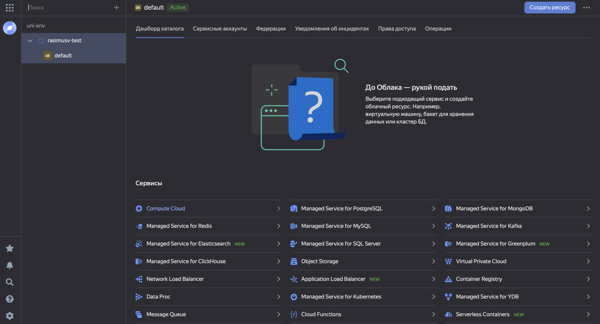

# Инструкция по деплою приложения, собранного в Docker-контейнерах, на платформу Yandex Cloud.
# Глава 1: Базовый деплой на инстанс Compute Cloud.
___

## План работы:
1. ### Знакомство с технологиями
2. ### Предупрждение
3. ### Создание инстанса Compute Cloud
4. ### Подключение к инстансу
5. ### Настройка Git, для работы с  GitLab
6. ### Установка необходимых пакетов
7. ### Сборка и деплой приложения в Docker

___

## Этап №1: Знакомство с технологиями

#### [Yandex Cloud](https://cloud.yandex.ru/docs/overview/) — это набор связанных сервисов, которые помогут вам быстро и безопасно взять в аренду вычислительные мощности в тех объемах, в которых это необходимо. При этом доступ к вычислительным мощностям вы получаете через интернет. Такой подход к потреблению вычислительных ресурсов называется облачные вычисления.
#### Вы могли слышать об иностранных аналогах, таких как [Amazon Web Services (AWS)](https://aws.amazon.com/ru/) или [Microsoft Azure](https://azure.microsoft.com/ru-ru/)
Облачные вычисления заменяют и дополняют традиционные дата-центры, расположенные на территории потребителя. Yandex Cloud берет на себя задачи по поддержанию работоспособности и производительности аппаратного и программного обеспечения облачной платформы.

#### В рамках текущего гайда мы будем работать с сервисом [Yandex Compute Cloud](https://cloud.yandex.ru/docs/compute/).
> Сервис Yandex Compute Cloud предоставляет масштабируемые вычислительные мощности для создания виртуальных машин и управления ими. Сервис поддерживает прерываемые виртуальные машины, а также отказоустойчивые группы виртуальных машин.

#### Косвенно мы затронем [Yandex Virtual Private Cloud](https://cloud.yandex.ru/docs/vpc/), создавая подсеть для инстанса Compute Cloud

> Yandex Virtual Private Cloud служит для управления облачными сетями и связи облачных ресурсов между собой и с интернетом. Virtual Private Cloud позволяет создавать сети, подсети в зонах доступности Yandex Cloud, назначать облачным ресурсам внутренние и публичные IP-адреса, а также предоставляет возможность защиты от DDoS-атак с помощью компонента DDoS-Protection.

___

## Этап №2: Предупрждение

### Данный гайд не является инструкцие по деплою приложения в продашен среду. Текущий гайд создан с целью ознакомления с различными сервисами Yandex Cloud и предполагает наиболее простой сценарий минимального деплоя приложения в Docker среде.

___

## Этап №3: Создание инстанса Compute Cloud

##### В начале работы, вы увидите [страницу консоли Yandex Cloud](https://console.cloud.yandex.ru/). В базовом состоянии ни один сервис не подключен

https://cloud.yandex.ru/docs/compute/operations/vm-connect/ssh?utm_source=console&utm_medium=side-bar-left&utm_campaign=compute

`ssh-keygen -C "name.surname"`

`cat ~/.ssh/id_rsa_yandex.pub`
#
#
#
#

___

## Этап №4: Подключение к инстансу

https://cloud.yandex.ru/docs/compute/operations/vm-connect/ssh?utm_source=console&utm_medium=side-bar-left&utm_campaign=compute

`ssh student@12.345.67.890 -i ~/.ssh/id_rsa_yandex`
___

## Этап №5: Настройка Git, для работы с  GitLab
sudo apt install git -y

git config --global user.name "FIRST_NAME LAST_NAME"
git config --global user.email "MY_NAME@example.com"

ssh-keygen -t ed25519 -C "name.surname"

/home/rasimusv/.ssh/id_ed25519_gitlab

cat ~/.ssh/id_ed25519_gitlab.pub

https://gitlab.com/-/profile/keys
___

## Этап №6: Установка необходимых пакетов

cd /opt/

sudo git clone repo-link

cd django-2k-11-000/

curl -fsSL https://download.docker.com/linux/ubuntu/gpg | sudo apt-key add -

sudo add-apt-repository "deb [arch=amd64] https://download.docker.com/linux/ubuntu focal stable" -y

sudo apt update -y

sudo apt install docker-ce docker-compose -y

sudo usermod -a -G docker $USER
___

## Этап №7: Сборка и деплой приложения в Docker

git clone https://github.com/rasimusv/examjava2022.git

sudo COMPOSE_DOCKER_CLI_BUILD=1 DOCKER_BUILDKIT=1 docker-compose up --build
___